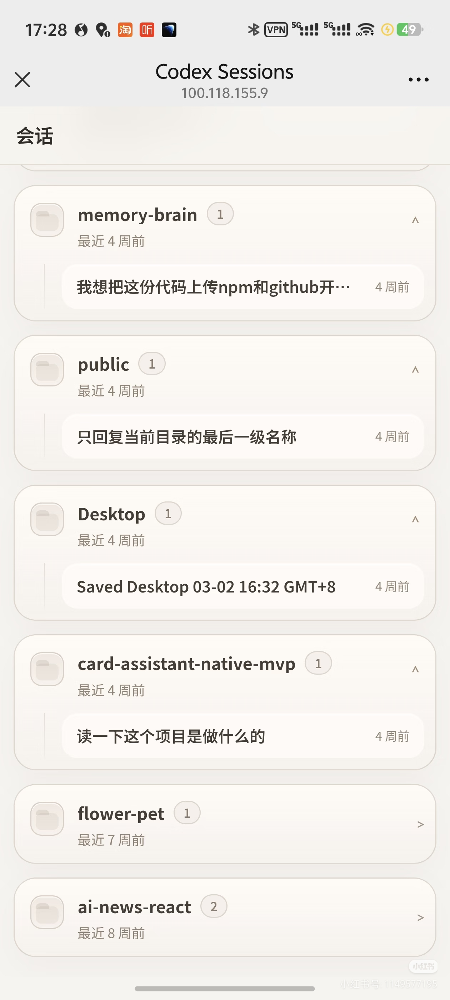
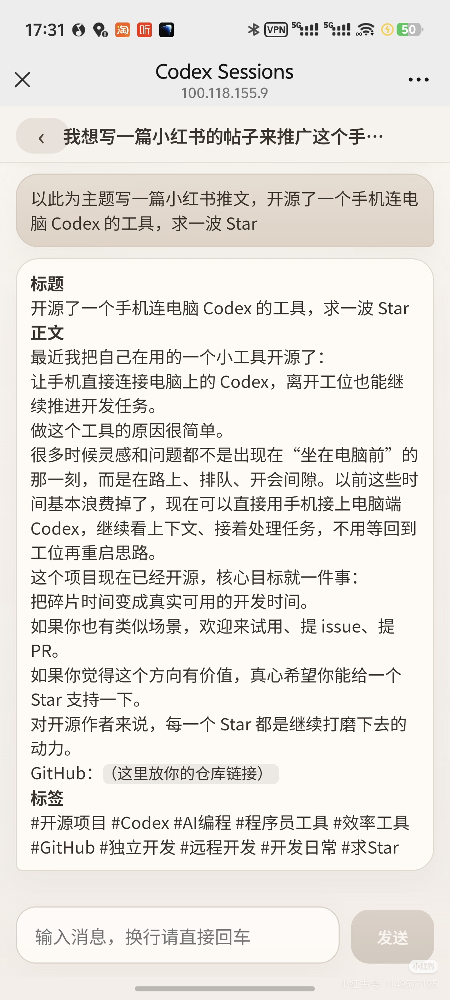

# codex-mobile-terminal

把你电脑上的本地 `codex` CLI 会话放到手机或平板浏览器里用。这个项目提供一个 Node.js + Koa 后端、Vue 3 前端和 WebSocket 实时通道，适合局域网访问，也适合配合 Tailscale 做远程访问。

## 核心功能

- 手机端会话列表、聊天页和新建会话流程
- WebSocket 流式输出，支持长回复与增量刷新
- 多会话管理，支持按工作目录创建和恢复 Codex 会话
- 登录鉴权、Origin 校验、限流和可选的 Tailscale 访问限制
- PM2 与 launchd 辅助脚本，便于长期运行

## 架构概览

```text
浏览器 / 手机
  -> HTTP API + /ws
  -> Koa 服务
  -> SessionManager
  -> node-pty / codex app-server
```

关键入口：

- 后端：`src/server.js`
- 前端：`web/src/main.js`
- 会话管理：`src/sessionManager.js`
- app-server 桥接：`src/appServerBridge.js`

## 环境要求

- Node.js 22+
- 已安装并可直接执行的 `codex` CLI
- 如需跨网络访问，推荐安装 [Tailscale](https://tailscale.com/download)

## 快速开始

```bash
git clone <your-repo-url>
cd codex-mobile-terminal
cp .env.example .env
```

在 `.env` 中至少设置一个强随机 `ACCESS_TOKEN`，然后安装依赖并启动：

```bash
npm install
npm run dev
```

如果你希望使用交互式安装向导：

```bash
npm run setup
```

默认访问地址：

- 前端开发模式：`http://127.0.0.1:5173/#/sessions`
- 后端直连：`http://127.0.0.1:3210`

## 手机访问

同一 Wi-Fi：

```env
HOST=0.0.0.0
```

然后在手机浏览器打开 `http://<电脑局域网IP>:3210`，使用 `ACCESS_TOKEN` 登录。

Tailscale 远程访问：

```env
TAILSCALE_ONLY=true
```

然后在电脑上执行：

```bash
tailscale ip -4
```

手机端访问 `http://<Tailscale-IP>:3210`。

## 安全建议

- 不要提交 `.env`、日志、运行数据或构建产物
- 公开网络场景下不要只依赖弱口令，至少开启 `TAILSCALE_ONLY=true` 或配置 `TRUSTED_CIDRS`
- 发布前全仓搜索 token、本地绝对路径和临时测试脚本

## 常用命令

```bash
npm run dev              # 前台开发模式
npm run dev:up           # macOS / Linux 后台开发模式
npm run dev:down         # 停止后台开发模式
npm run build            # 构建前端
npm run check            # 语法检查 + 构建验证
npm run test:backend:all # 后端测试
npm run service:start    # PM2 生产启动
npm run service:status   # 查看服务状态
```

## 目录结构

```text
codex-mobile-terminal/
├── src/        后端源码
├── web/        Vue 3 前端
├── tests/      后端测试
├── scripts/    开发与部署脚本
├── docs/       文档与截图
├── public/     兼容静态资源
└── .env.example
```

完整说明见 [PROJECT_STRUCTURE.md](./PROJECT_STRUCTURE.md)。

## 截图

<p align="center">
  
  
</p>

## 开源文档

- [项目结构](./PROJECT_STRUCTURE.md)
- [更新日志](./CHANGELOG.md)
- [贡献指南](./CONTRIBUTING.md)
- [安全策略](./SECURITY.md)
- [行为准则](./CODE_OF_CONDUCT.md)
- [文档索引](./docs/README.md)
